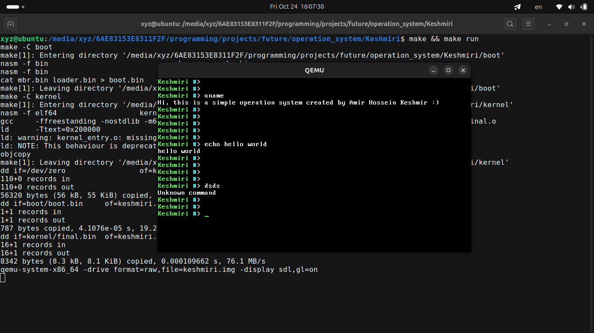
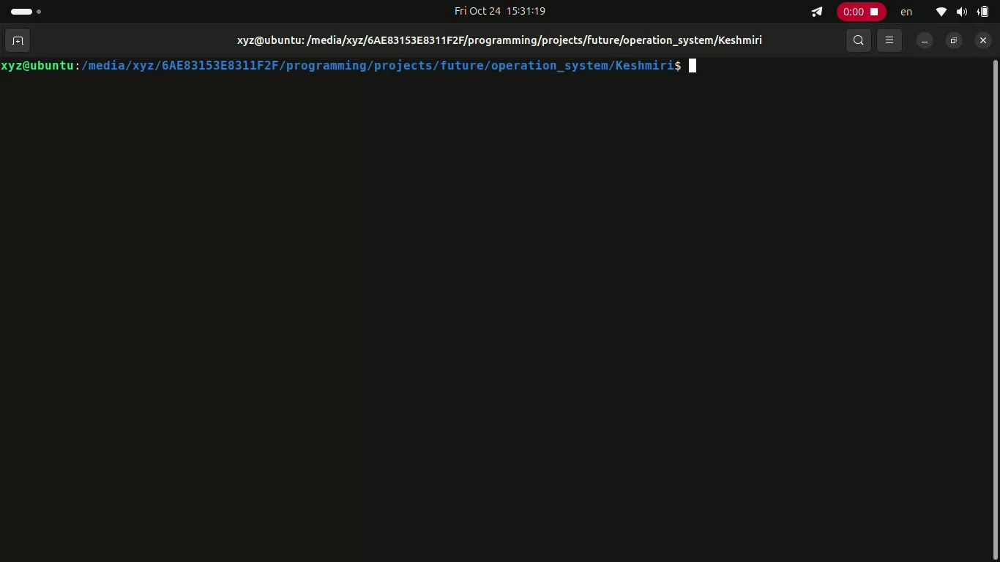

# Keshmiri Operation System

Keshmiri is a lightweight 64-bit operating system built from scratch for the x86_64 architecture.
It boots via BIOS and includes a basic command-line interface with the following built-in commands:

### Supported Commands
- uname
- echo &lt;TEXT&gt;
- clear

### 🖼️ Screenshot
A snapshot of the operating system running in QEMU:


### 🎦 Demo Video
Watch the OS boot and run commands:



## ⬇️ Download

```bash
git clone https://github.com/Amir-Hossein-Keshmiri/Keshmiri.git
```

## 🧩 Installation

```bash
sudo apt update
sudo apt install dd ld nasm objcopy qemu-system-x86_64 gcc
```

## ⚙️ Build and Run

```bash
make
make run
```

## 🧹 Clean

```bash
make clean
```

## 🚀 Planned Features
- File system support  
- Simple multitasking   
- Basic memory management
