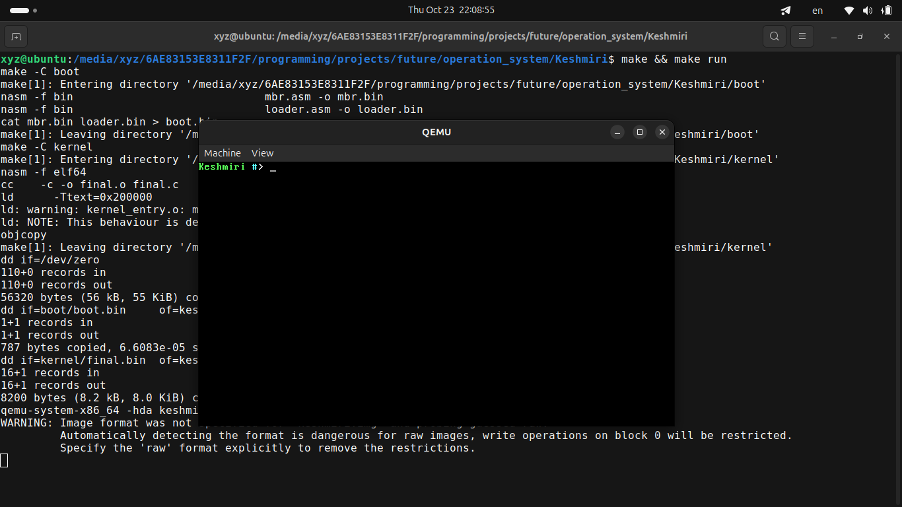

# Keshmiri Operation System

Keshmiri is a simple operating system for the x86_64 architecture, currently in early development stages. It boots with BIOS and can control screen characters in text mode.

## About this commit

Now my operating system boots successfully and displays characters on the screen.



## Download

```bash
git clone https://github.com/Amir-Hossein-Keshmiri/Keshmiri.git
```

## Update

```bash
sudo apt update 
```

## Install

```bash
sudo apt install dd ld nasm objcopy qemu-system-x86_64 gcc
```

## Build

```bash
make
```

## Run

```bash
make run
```

## Clean

```bash
make clean
```
