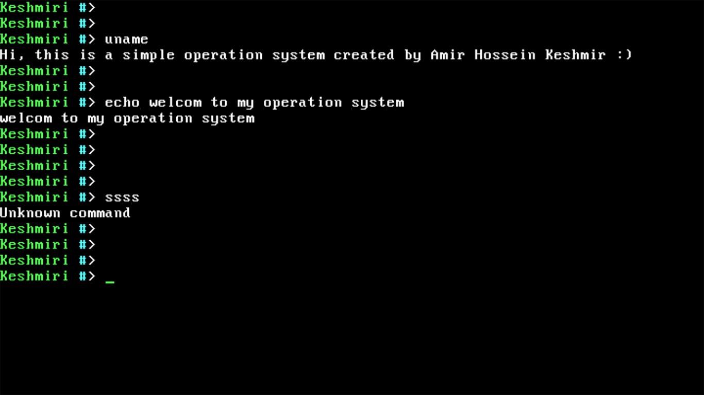

# Keshmiri Operation System

I wrote a simple operating system from scratch using assembly and C for the x86_64 architecture that boots with BIOS and currently supports the following commands

```
uname
echo <TEXT>
clear
```




## Video of running my operating system on a laptop
[video](https://www.youtube.com/watch?v=SRd5JuF0wTA)


## Download

```bash
git clone https://github.com/Amir-Hossein-Keshmiri/Keshmiri.git
```

## Run

```bash
suod apt update
sudo apt install qemu
qemu-system-x86_64 keshmiri.img
```
